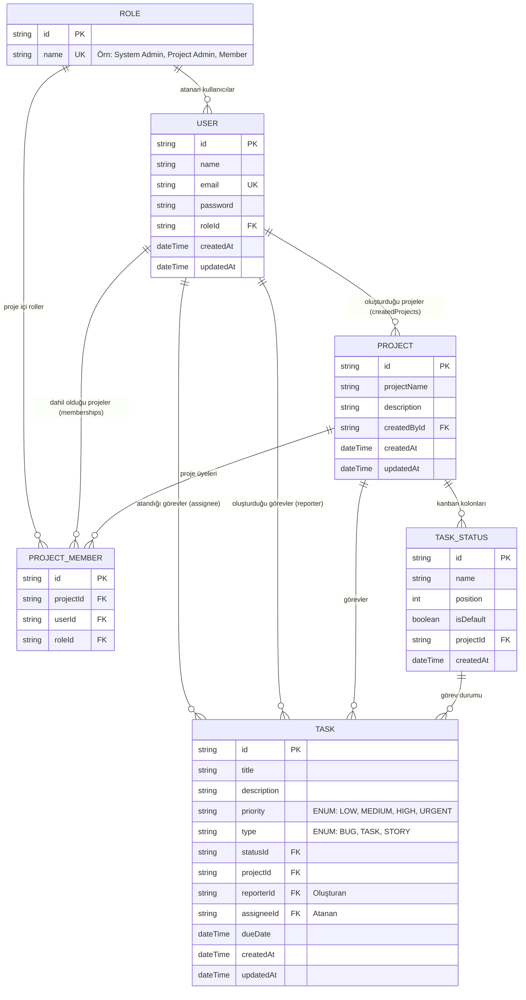

# Planora Veritabanı ER Diyagramı

Bu diyagram [Mermaid](https://mermaid.js.org/) formatında hazırlanmıştır. VS Code / Cursor üzerinde Markdown önizlemesi (**Ctrl+Shift+V** veya sağ üstteki önizleme butonu) ile görsel olarak görüntülenebilir.

